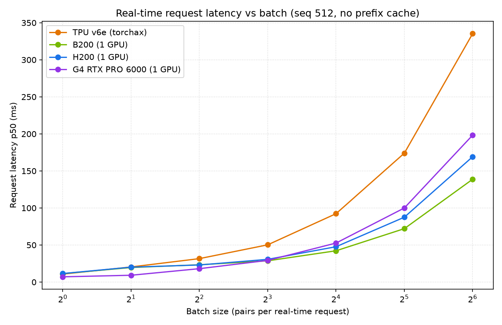
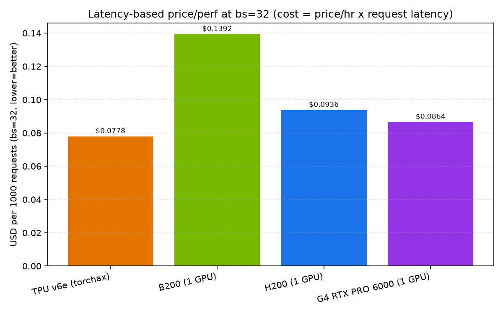
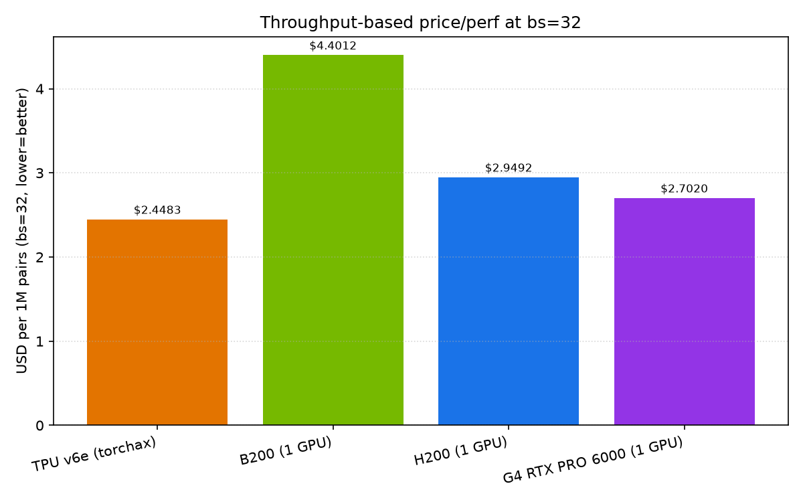
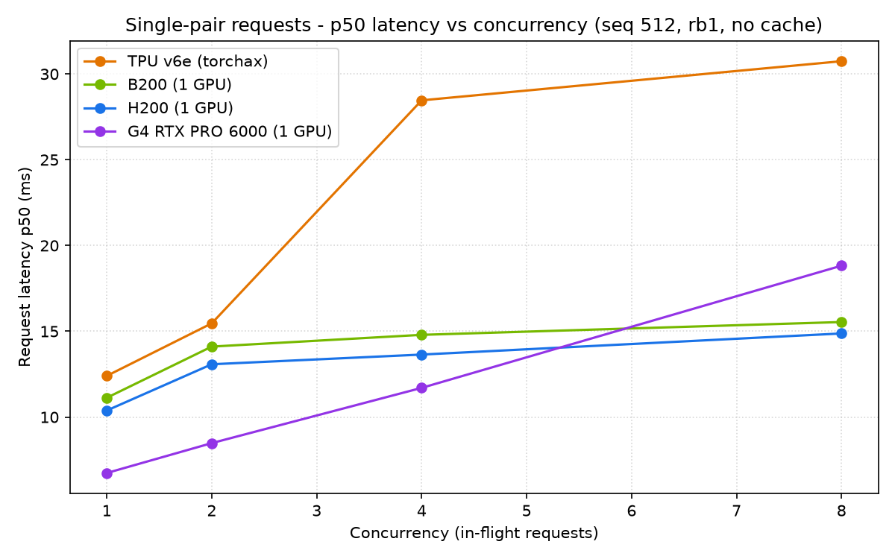
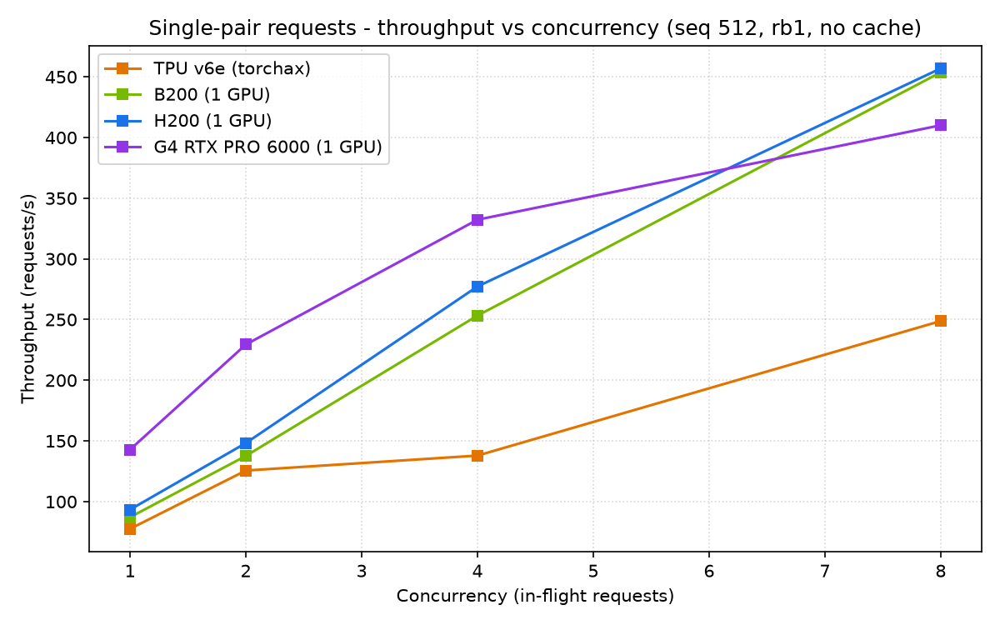

# Qwen3-Reranker-0.6B latency-first price/performance: TPU v6e vs B200 vs H200 vs G4

Real-time (online) serving benchmark of Qwen3-Reranker-0.6B on vLLM, focused on latency and
price/performance rather than offline batch throughput. TPU runs on the public JAX/torchax backend
(`tpu-inference`); GPUs run on CUDA vLLM. Every request is timed on-device (in-process `score()`),
so results are compute latency and do not depend on VM region.

Scope and rules (per customer request):
- Framework: vLLM torchax on TPU (no torch-tpu); CUDA vLLM on GPU.
- No caching: prefix caching disabled (`enable_prefix_caching=False`); every request uses freshly
  randomized content so KV/prefix reuse cannot inflate results.
- Standardized synthetic dataset: fixed sequence length 512 tokens per (query+document) pair.
- Real-time, not offline: each measured request is one in-flight `score()` call; "batch" means
  concurrent pairs in one real-time request, not an offline job.
- Primary operating point: batch size 32, seq 512; plus a batch sweep (1..64).
- Price/performance reported two ways: throughput-based (USD per 1M pairs) and latency-based
  (USD per 1000 requests), plus GPU-match analyses both ways: throughput-match (chips to match GPU throughput) and latency-match (match GPU latency, then compare cost).


Prices (per chip-hour): TPU v6e $1.61, B200 $6.95, H200 $3.85, G4 (1x RTX PRO 6000) $3.11.

All four accelerators are measured on a single chip each (G4 = 1x NVIDIA RTX PRO 6000).


## Metrics and formulas (how every number is computed)

Each measured "request" is one `llm.score()` call that scores all N pairs in the batch in one shot;
we run it `iters` times (50 for the latency sweep) and time the whole call each time. From those timings:

- request latency percentiles (ms): sort the per-request times; p50 = median, p90/p95/p99 = tail.
  `p50 = percentile(times, 50)`, etc. This is the time for ONE request of N pairs (e.g. bs=32 = one
  32-pair request), not per pair and not N separate requests.
- request_latency_ms_mean = average of those per-request times.
- per_pair_latency_ms_mean = request_latency_ms_mean / batch_size.
- throughput (pairs/s) = batch_size / (request_latency_ms_mean / 1000). Derived from the mean latency
  of the same batched call, e.g. B200 bs=32: 32 / (72.12/1000) ~= 443 pairs/s (json value 438.642 uses
  the exact mean).
- Throughput-based price/perf, USD per 1M pairs = (price_per_hour / 3600) / pairs_per_s * 1e6.
- Latency-based price/perf, USD per 1000 requests = (price_per_hour / 3600) * (p50_ms / 1000) * 1000.
- Concurrency sweep (served): each request is a single pair (or a batch of rb pairs) sent over HTTP to
  `vllm serve /v1/rerank`; C requests are kept in flight. qps = iters / wall_seconds; latency
  percentiles are of the per-request times; USD/1k uses the same latency formula above.
- Throughput-match: v6e chips to match a GPU = ceil(GPU pairs/s / one-v6e pairs/s); fleet $/hr = chips * $1.61.
- Latency-match: pick the largest v6e batch whose p50 <= the GPU's p50, then compare USD/1k requests.

Prices per chip-hour used everywhere: TPU v6e $1.61, B200 $6.95, H200 $3.85, G4 $3.11.

## Headline (batch size 32, seq 512, no caching)


| Device | p50 latency (ms) | p99 latency (ms) | pairs/s | $/1M pairs (throughput) | $/1000 req (latency) |
|---|---:|---:|---:|---:|---:|
| TPU v6e (torchax) | 173.995 | 187.747 | 182.667 | $2.4483 | $0.07781 |
| B200 (1 GPU) | 72.120 | 78.676 | 438.642 | $4.4012 | $0.13923 |
| H200 (1 GPU) | 87.551 | 98.340 | 362.625 | $2.9492 | $0.09363 |
| G4 RTX PRO 6000 (1 GPU) | 100.025 | 101.605 | 319.721 | $2.7020 | $0.08641 |

How to read it:
- Raw per-request latency (bs=32): B200 fastest (72.1 ms), then H200 (87.6), then G4 (100.0), then
  TPU v6e (174.0).
- Price/performance (both views): TPU v6e is cheapest overall ($2.4483/1M, $0.07781/1k req). Among
  the GPUs, G4 is the best value ($2.7020/1M, $0.08641/1k), ahead of H200 ($2.9492 / $0.09363) and
  well ahead of B200 ($4.4012 / $0.13923). So cost ranking is TPU v6e, then G4, then H200, then B200;
  latency ranking is B200, then H200, then G4, then TPU.

## Latency and price/perf views





Request latency p50 (ms) by batch size:

| Batch | TPU v6e | B200 | H200 | G4 |
|------:|--------:|-----:|-----:|---:|
| 1 | 10.793 | 11.451 | 11.533 | 7.104 |
| 2 | 20.423 | 19.653 | 20.153 | 9.221 |
| 4 | 31.673 | 23.388 | 23.098 | 18.122 |
| 8 | 50.295 | 28.720 | 30.696 | 29.281 |
| 16 | 92.316 | 42.255 | 47.730 | 52.677 |
| 32 | 173.995 | 72.120 | 87.551 | 100.025 |
| 64 | 335.344 | 138.802 | 169.198 | 198.313 |

Throughput (pairs/s) by batch size:

| Batch | TPU v6e | B200 | H200 | G4 |
|------:|--------:|-----:|-----:|---:|
| 1 | 92.239 | 85.498 | 85.185 | 139.995 |
| 2 | 100.221 | 116.606 | 98.105 | 178.580 |
| 4 | 118.104 | 183.052 | 181.414 | 229.313 |
| 8 | 155.212 | 282.684 | 262.667 | 273.581 |
| 16 | 172.784 | 379.786 | 332.293 | 303.367 |
| 32 | 182.667 | 438.642 | 362.625 | 319.721 |
| 64 | 190.484 | 460.704 | 376.102 | 321.662 |

Notes:
- At batch size 1 (strict one-at-a-time serving) the G4 is actually the fastest single-request device
  (p50 7.104 ms), ahead of TPU v6e (10.793), B200 (11.451) and H200 (11.533). So for low-concurrency
  real-time reranking, G4 gives the best raw latency and TPU v6e the best cost.
- The B200 pulls ahead at larger batches, as expected from its higher parallel throughput.

## GPU-match analysis (two ways): throughput-match and latency-match

We provide both matching views; full per-batch tables are in `charts/latency_priceperf_tables.md`.

### 1) Throughput-match (how many v6e chips equal one GPU's throughput)
chips = ceil(GPU pairs/s / one-v6e pairs/s); v6e fleet $/hr = chips x $1.61. Examples at bs=32:
- vs B200: 3x v6e = $4.83/hr vs $6.95/hr -> TPU fleet cheaper.
- vs H200: 2x v6e = $3.22/hr vs $3.85/hr -> TPU fleet cheaper.
- vs G4: 2x v6e = $3.22/hr vs $3.11/hr -> the 2-chip fleet-hour is marginally above one G4 only because
  chips round up to whole units; on per-pair/per-request cost the TPU is still cheaper (see headline).

### 2) Latency-match (match a GPU's request latency, then compare cost)

For a given GPU request latency, find the TPU v6e configuration that serves within the same latency
budget, then compare cost per 1000 requests. (We take each GPU batch's p50 latency, pick the fastest
v6e batch whose p50 is still <= that latency, and compare $/1k requests.)


Result: at equal latency, the TPU v6e is cheaper in essentially every case. Examples:
- Match B200 at its bs=32 latency (72.1 ms): v6e runs at bs=8 (50.3 ms, well within budget) for
  $0.02249 / 1k req vs B200 $0.13923 / 1k -> TPU about 6.2x cheaper at the same latency.
- Match H200 at its bs=32 latency (87.6 ms): v6e at bs=8 (50.3 ms) for $0.02249 / 1k vs H200
  $0.09363 / 1k -> TPU about 4.2x cheaper.
- Match G4 at its bs=32 latency (100.0 ms): v6e at bs=16 (92.3 ms) for $0.04129 / 1k vs G4 $0.08641 /
  1k -> TPU about 2.1x cheaper.

The one exception is ultra-low single-request latency: the G4 hits 7.1 ms at bs=1, which the v6e
cannot match (its floor is ~10.8 ms), so if the SLA requires sub-10 ms per request the G4 is the only
option here. Everywhere the TPU can meet the latency budget, it does so at lower cost.

Note on price/performance ranking: the TPU v6e is the cheapest per pair and per request at every
batch size (see the headline table). The G4 is the best-value GPU, but it is still more expensive than
the TPU on both price/perf views.


## Concurrency sweep (served vLLM, real-time load)

In addition to the single-request latency study above, we ran a served-endpoint concurrency sweep
(`vllm serve` + async client hitting `/v1/rerank`, prefix caching OFF, fresh content per request) to
show behaviour under simultaneous in-flight requests. Full tables and charts:
`charts/concurrency_tables.md`, `charts/concurrency_seq512_rb1_p50.png`,
`charts/concurrency_seq512_rb1_qps.png`, plus rb32 and seq1024 variants.

Single-pair requests (seq 512), p50 latency and requests/s at concurrency 1/2/4/8:

| Conc | TPU v6e p50 | B200 p50 | H200 p50 | G4 p50 |
|---:|---:|---:|---:|---:|
| 1 | 12.4 ms | 11.1 ms | 10.4 ms | 6.7 ms |
| 2 | 15.5 ms | 14.1 ms | 13.1 ms | 8.5 ms |
| 4 | 28.5 ms | 14.8 ms | 13.6 ms | 11.7 ms |
| 8 | 30.7 ms | 15.5 ms | 14.9 ms | 18.8 ms |
| peak req/s | 249 | 454 | 457 | 410 |

Takeaways:
- This matches the customer's "~20 ms on B200 at conc 1" observation: served single-pair p50 on B200
  is ~11 ms at conc 1 and stays ~15 ms through conc 8 while throughput climbs to ~454 req/s.
- At conc 1 the G4 is the fastest single request (6.7 ms). The GPUs scale throughput better at high
  concurrency (450+ req/s); the TPU tops out around ~249 req/s and its latency rises faster past conc 4.
- On latency-based cost per 1000 requests (single pair, seq 512) the TPU and G4 are cheapest at low
  concurrency; e.g. at conc 1 TPU $0.00555, G4 $0.00582, H200 $0.0111, B200 $0.02148 per 1k requests.

Heavier workloads (batch-32-per-request) and long context (seq 1024) are in
`charts/concurrency_tables.md`. For a rough p90 < 100 ms SLA: single-pair requests hold p90 < 100 ms
through conc 8 on all four chips; a bs32-per-request workload only holds p90 < 100 ms at conc 1 on
B200 and H200 (the others exceed it), i.e. large per-request batches should be kept to low concurrency
or split into smaller requests.




## Reproduce


TPU v6e (torchax / tpu-inference):
```bash
source "$HOME/.local/bin/env"; uv venv --python 3.12 "$HOME/tpuinf_venv"; source "$HOME/tpuinf_venv/bin/activate"
uv pip install vllm-tpu transformers
export HF_HOME=/dev/shm/hf; export HF_TOKEN=<token>; cd /tmp
python scripts/reranker_latency_bench.py --device-label "tpu v6e-1 (torchax)" --is-tpu \
  --seq-len 512 --batch-sizes 1,2,4,8,16,32,64 --iters 50 --result-filename ~/lat_tpu_torchax.json
```

GPUs (B200 / H200 / G4), one GPU each:
```bash
sudo apt-get update -qq && sudo DEBIAN_FRONTEND=noninteractive apt-get install -y -qq build-essential g++ python3.12-dev

source "$HOME/.local/bin/env"; uv venv --python 3.12 "$HOME/gpuvenv"; source "$HOME/gpuvenv/bin/activate"
uv pip install vllm transformers
CUDA_VISIBLE_DEVICES=0 python scripts/reranker_latency_bench.py --device-label "gpu 1x <B200|H200|G4>" \
  --seq-len 512 --batch-sizes 1,2,4,8,16,32,64 --iters 50 --gpu-mem-util 0.85 \
  --result-filename ~/lat_gpu_<b200|h200|g4>.json
```

Charts + tables:
```bash
pip install matplotlib
python scripts/make_latency_priceperf.py
```

## Files

```
results/lat_tpu_torchax.json   TPU v6e latency sweep (seq 512, no prefix cache)
results/lat_gpu_b200.json      B200 latency sweep
results/lat_gpu_h200.json      H200 latency sweep
results/lat_gpu_g4.json        G4 (RTX PRO 6000) latency sweep
scripts/reranker_latency_bench.py   latency bench (prefix caching off, fresh random content, seq 512)
scripts/make_latency_priceperf.py   charts + tables (throughput and latency price/perf, latency-match)
charts/latency_vs_batch.png, priceperf_latency_bs32.png, priceperf_throughput_bs32.png
charts/latency_priceperf_tables.md
```

## Verification

Run `python scripts/audit_repo.py` to verify end-to-end: it re-checks every results JSON for internal consistency (throughput = batch/latency, monotonic percentiles, prefix caching disabled, seq 512), recomputes both price/perf views and confirms they match the README and the generated tables, verifies every README latency/throughput number exists in the raw JSON, checks the throughput-match and latency-match math, confirms all referenced charts exist, and re-runs the table generator to confirm deterministic output. Current status: AUDIT PASSED.

